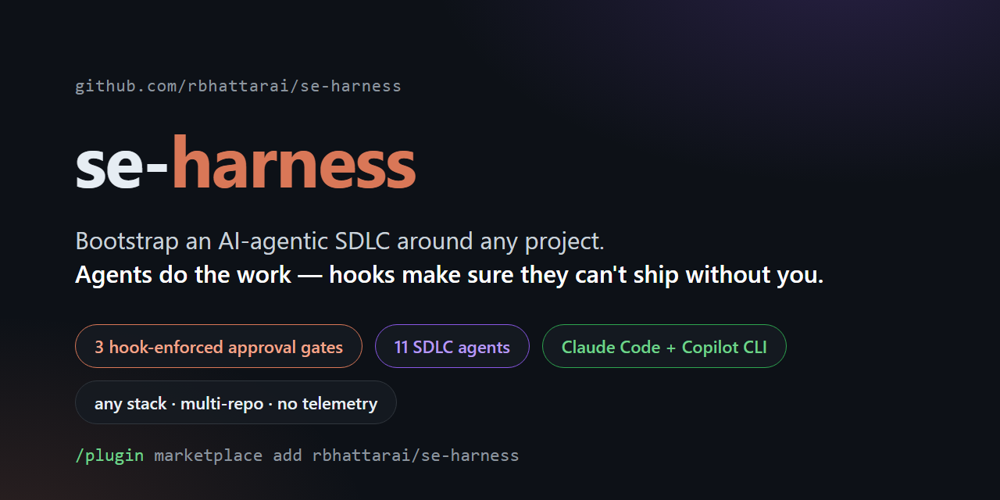

# se-harness



**An AI-agentic SDLC harness you can bootstrap around any software project — new or
existing, any stack, single-repo or multi-repo. AI agents do the work; hooks make sure
they can't ship without you.**

[](https://github.com/rbhattarai/se-harness/releases)
[](./LICENSE)
[](https://github.com/rbhattarai/se-harness/actions/workflows/ci.yml)
[](https://github.com/rbhattarai/se-harness/actions/workflows/ci.yml)
[](./docs/setup-guide-claude.md)
[](./docs/setup-guide-copilot.md)
[](./plugins/se-harness/agents)
[](./plugins/se-harness/hooks)
[](./docs)
[](./PRIVACY.md)

AI coding agents are good at writing code and bad at process discipline. se-harness wraps
a full software-engineering lifecycle around them: it learns your project (scan +
interview), staffs it with 11 specialized agents, and runs each goal through
requirement → stories → implementation → tests → PR → deploy — pausing at **three
human-approval gates that are enforced by hooks, not prompts**. The agent literally cannot
open the PR, push, or deploy until *you* flip `status: approved`.

One repo serves **both ecosystems**: Claude Code and GitHub Copilot CLI read the same
plugin marketplace.

<!-- DEMO GIF — record with docs/demo/README.md, save as docs/assets/demo.gif,
     then uncomment:


-->

## What you get

- **Bootstrap, not boilerplate** — `/harness-init` scans existing repos first (stack +
  org-convention detection, evidence-based, you confirm) and interviews you only for what
  it can't detect. Output: `AGENTS.md` + `CLAUDE.md` inside idempotent generated-block
  markers (your hand edits survive re-runs), a committed `.harness/` profile, and a
  gitignored `.env.harness` for secrets.
- **A goal loop with real gates** — `/harness-goal "Add CSV export"` grills you until the
  requirement is unambiguous, writes `.harness/requirements/REQ-001.md`, then drives
  stories → design → parallel implementation in isolated worktrees → unit/integration/e2e
  tests → PR → deploy. Three gates (requirement, PR evidence, deploy) are blocked by a
  `PreToolUse` hook until you approve — exit-2 block on Claude Code, `permissionDecision`
  deny on Copilot.
- **An 11-agent SDLC roster** — architect, story-writer, backend/frontend implementers,
  db-engineer, unit + integration testers, e2e planner/generator/healer, release-manager.
  Each agent gets only the tools its job needs.
- **3-tier memory** — committed project profile, append-only daily/topic logs with typed
  causal links, and a provenance-tracked domain wiki (ingest/query/lint skills).
- **Multi-repo aware** — declare products in `workspace.yaml` with a contracts registry;
  `contract-check.sh` blocks pushes that change a provided contract and names the consumer
  repos that would break.
- **Drift-aware sync** — `/harness-sync` detects drift on four axes (profile,
  recommendations, templates, memory health), shows the diff first, and refreshes only
  generated blocks.
- **Exportable** — `/harness-export` compiles the agents and hooks for Copilot and Cursor
  (Codex reads `AGENTS.md` natively).
- **No telemetry, ever** — see [PRIVACY.md](./PRIVACY.md).

## Install

**Claude Code** (inside a session):

```
/plugin marketplace add rbhattarai/se-harness
/plugin install se-harness
```

**GitHub Copilot CLI**:

```bash
copilot plugin marketplace add rbhattarai/se-harness
copilot plugin install se-harness-copilot@se-harness
```

**Plugin installs restricted in your org?** Both setup guides cover the alternatives —
internal GitHub Enterprise import (preferred, updates stay pullable) and offline
zip → local-path marketplace, plus a no-plugin prompt-driven fallback:
[Claude §1.2](./docs/setup-guide-claude.md) · [Copilot §1.2–1.3](./docs/setup-guide-copilot.md).

## Quickstart (5 minutes)

**Single repo** — in your project, run `/harness-init` (Claude) or `copilot harness-init`
(Copilot CLI). Existing repos get scanned first; you're interviewed only for what can't be
detected. Then `/harness-bootstrap` for opt-in companion tooling, and your first goal:

```
/harness-goal "Add CSV export to the reports page"
```

It writes `.harness/requirements/REQ-001.md` and the gate hook blocks PR/push/deploy until
**you** flip `status: approved`.

**Multi-repo product** — clone all repos side-by-side, add a `workspace.yaml` (from
[`templates/workspace.yaml`](./templates/workspace.yaml): units, shared org context, and a
`contracts:` registry), then run the same init per code repo.

### Commands

| Command | What it does |
|---|---|
| `/harness-init` | Intake interview (+ scan for existing repos) → generates all per-project artifacts |
| `/harness-scan` | Brownfield detection: evidence collector → confirm → merge into profile |
| `/harness-bootstrap` | Recommends companion plugins/CLIs/MCP servers from your profile; opt-in install + lockfile |
| `/harness-goal` | The goal loop: supervisor over the agent roster, 3 hook-enforced approval gates |
| `/harness-sync` | Four-axis drift detection → diff-first report → confirmed refresh of generated blocks |
| `/harness-export` | Compile agents + hooks for Copilot / Cursor (Codex reads `AGENTS.md` natively) |

## Documentation

- **[Claude Code setup guide](./docs/setup-guide-claude.md)** — install (+ restricted-org
  alternatives), single-repo and multi-repo worked examples, extending and publishing
- **[GitHub Copilot setup guide](./docs/setup-guide-copilot.md)** — CLI plugin, coding
  agent, VS Code, enterprise rollout, same examples
- **[Interop matrix](./docs/interop-matrix.md)** — component × platform support, plus
  verified platform schema notes in [`docs/claude/`](./docs/claude) and
  [`docs/copilot/`](./docs/copilot)

## Status

**v1 is complete**: all six commands, the 11-agent roster, the memory tiers, the hooks, and
the Copilot export are implemented and script-tested (123-test suite in CI). On the roadmap:
a workspace-level goal loop over a federated service graph, a web profile-builder, and
real-world hardening. Details: [development history](./docs/development-history.md) ·
plan and research log in [`brainstorm.md`](./brainstorm.md).

## Repo layout

```
.claude-plugin/marketplace.json      # this repo IS a marketplace — read by Claude Code AND Copilot CLI
.github/plugin/marketplace.json      # GENERATED mirror (Copilot canonical location) — never edit
plugins/se-harness/                  # the harness plugin (source of truth)
  commands/                          # the six /harness-* commands
  agents/                            # 11-agent SDLC roster (narrow tools per agent)
  skills/                            # context-injector, stack-detector, memory-keeper, wiki-*
  hooks/hooks.json + scripts/        # gate-check, org-validate, memory-log, contract-check, splicer
plugins/se-harness-copilot/          # Copilot CLI variant — GENERATED by build-copilot-plugin.sh
registry/recommendations.json        # profile → plugin mappings (recommender data; honest gaps)
templates/                           # profile/env/requirement/AGENTS/CLAUDE/mcp/workspace + memory seeds
docs/                                # setup guides, interop matrix, platform schema notes
tests/                               # 123-test suite run in CI
```

## Contributing / publishing

Edit only `plugins/se-harness/` (the Claude-first source of truth); regenerate the Copilot
variant and marketplace mirror with `bash plugins/se-harness/scripts/build-copilot-plugin.sh`.
Full update/extension and marketplace-publishing instructions:
[Claude guide Parts 5–6](./docs/setup-guide-claude.md) ·
[Copilot guide Parts 10–11](./docs/setup-guide-copilot.md).

> Note: the Claude Code and Copilot plugin/hook schemas evolve quickly — verify manifests
> against the [Claude plugin docs](https://code.claude.com/docs/en/plugins-reference) and
> [Copilot plugin docs](https://docs.github.com/en/copilot/reference/copilot-cli-reference/cli-plugin-reference)
> before releasing.
